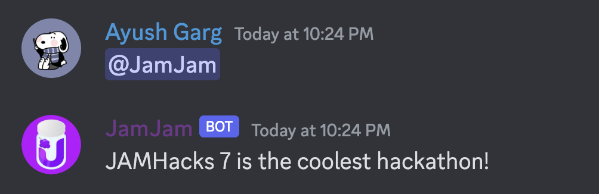
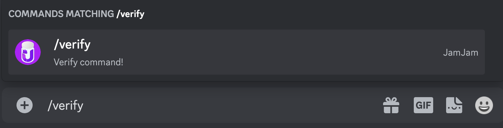

# JamJam

Verification Discord Bot for JAMHacks Hackathon hosted at the [University of Waterloo](http://uwaterloo.ca)

[JAMHacks Website](https://www.jamhacks.ca)




## Getting Started

To use JamJam on your own system follow these instructions

```bash
git pull https://github.com/Jamhacks-Hackathon/JamJam.git # Clone the JamJam repo on your system

# cd into the project directory

yarn # install all the dependencies using yarn
OR
npm i # install all the dependencies using npm

Rename .example.env file to .env and insert your credentials

yarn / npm dev # Run the Discord Bot
```

If you would like to host the bot using the replit method that was used for JAMHacks 7 please refer to [Hosting a Discord bot on Repl.it](https://dev.to/fizal619/so-you-want-to-make-a-discord-bot-4f0n)

- Update the random hardcoded channel id and role ids

## References

[Naming Conventions](https://www.30secondsofcode.org/articles/s/javascript-naming-conventions)
(In some places the naming conventions were not followed due to how jamhacks.ca was constructed)

[Eslint Rules](https://eslint.org/docs/latest/rules/)

[Discord.js Documentation](http://discord.js.org)

[Discord.js Guide](http://discordjs.guide)

## Future Plans

JamJam functions as a basic user verification discord bot for JAMHacks. As of now, we plan to maintain this bot by keeping it up to date with Discord's API versions using [discord.js](https://www.npmjs.com/package/discord.js) npm package. In the future we may add more "fun" features or features to further assist the JAMHacks hackathon instead of just verifying users.

## Contributors

JAMHacks 7 - [Ayush Garg](http://linkedin.com/in/lazeash/)

JAMHacks 9 - [Jason Cameron](http://linkedin.com/in/jsoncameron/)
